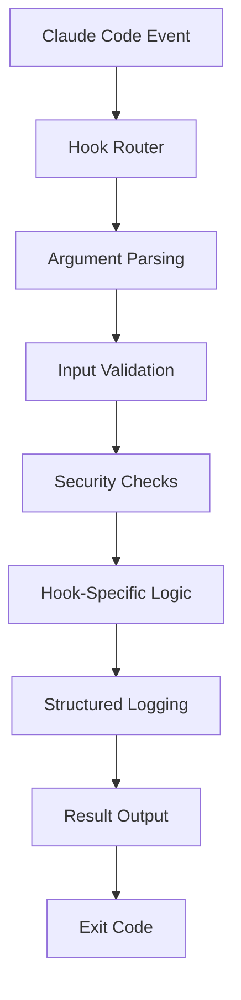

# Claude Code Hook System 🚀

A comprehensive TypeScript-based hook implementation for Claude Code with security validation, logging, TTS announcements, and AI-powered completion messages.

## ✨ Features

- 🔒 **Security-first**: Environment file protection, dangerous command detection
- 📊 **Comprehensive logging**: Structured JSON logs with audit trails
- 🎯 **AI-powered completions**: Dynamic session completion messages
- 🔊 **TTS announcements**: Multi-provider text-to-speech integration
- ⚡ **Performance optimized**: Smart timeouts and resource limits
- 🛡️ **Type-safe**: Full TypeScript implementation with strict typing
- 🧪 **Well-tested**: Comprehensive test suite with coverage

## 🚀 Quick Start

### Installation

```bash
# Install dependencies
bun install

# Verify installation
bun index.ts --help
```

### Basic Usage

```bash
# Session completion with transcript copying
bun index.ts stop --chat

# Security validation for tool usage
bun index.ts pre_tool_use

# User notification handling
bun index.ts notification

# Get help and available options
bun index.ts --help
bun index.ts --list
```

## 📋 Available Hooks

| Hook Type | Description | Key Features |
|-----------|-------------|--------------|
| `notification` | User input waiting notifications | Terminal notifications, structured logging |
| `pre_tool_use` | Pre-tool execution security validation | .env protection, dangerous command detection |
| `post_tool_use` | Post-tool execution logging and analysis | Comprehensive usage analytics, performance tracking |
| `user_prompt_submit` | User prompt submission processing | Input validation, submission logging |
| `stop` | Session completion handler | Linting integration, TTS, AI completion messages |
| `subagent_stop` | Subagent completion processing | Transcript copying, specialized announcements |

## 🔧 Configuration

### Environment Variables

Create `.env` file for optional features:

```bash
# TTS Configuration (optional)
ELEVENLABS_API_KEY=your_elevenlabs_key
OPENAI_API_KEY=your_openai_key

# LLM Configuration for AI completion messages (optional)
LLM_DEFAULT_MODEL=gpt-4o-mini
ANTHROPIC_API_KEY=your_anthropic_key

# Logging Configuration
LOG_LEVEL=info              # debug, info, warn, error
MAX_LOG_SIZE=1048576        # 1MB default
HOOK_TIMEOUT=60000          # 60s default timeout
```

### Claude Code Integration

Add to your `~/.config/claude/settings.json`:

```json
{
  "hooks": {
    "notification": {
      "command": "cd /path/to/dotfiles/.claude/hooks && bun index.ts notification"
    },
    "pre_tool_use": {
      "command": "cd /path/to/dotfiles/.claude/hooks && bun index.ts pre_tool_use"
    },
    "post_tool_use": {
      "command": "cd /path/to/dotfiles/.claude/hooks && bun index.ts post_tool_use"
    },
    "user_prompt_submit": {
      "command": "cd /path/to/dotfiles/.claude/hooks && bun index.ts user_prompt_submit"
    },
    "stop": {
      "command": "cd /path/to/dotfiles/.claude/hooks && bun index.ts stop --chat"
    },
    "subagent_stop": {
      "command": "cd /path/to/dotfiles/.claude/hooks && bun index.ts subagent_stop --chat"
    }
  }
}
```

## 🏗️ Architecture

### Core Components

```
.claude/hooks/
├── index.ts                  # Main entry point and router
├── types.ts                  # TypeScript interfaces and types
├── utils.ts                  # Shared utilities and security functions
├── config.ts                 # Configuration management
├── hooks/                    # Individual hook implementations
│   ├── notification.ts       # User notification handler
│   ├── pre_tool_use.ts      # Security validation hook
│   ├── post_tool_use.ts     # Post-execution logging
│   ├── user_prompt_submit.ts # Prompt processing
│   ├── stop.ts              # Session completion with AI/TTS
│   └── subagent_stop.ts     # Subagent completion handler
├── logs/                     # JSON log files (auto-created)
├── tests/                    # Comprehensive test suite
└── package.json             # Project configuration
```

### Hook Execution Flow



## 🔒 Security Features

### Multi-Layer Protection

1. **Environment File Protection**
   - Blocks access to `.env`, `.env.local`, `.env.production`
   - Allows safe files like `.env.example`, `.env.template`
   - Configurable patterns and exclusions

2. **Dangerous Command Detection**
   ```typescript
   // Detected patterns
   - rm -rf commands
   - eval statements
   - command injection attempts
   - direct device access
   - path traversal attempts
   ```

3. **Input Sanitization**
   - JSON schema validation
   - File path validation (max 500 chars)
   - Command length limits (max 1000 chars)
   - Output size limits (1MB with truncation)

4. **Resource Protection**
   - Process timeout enforcement
   - Memory usage limits
   - Concurrent execution controls

## 📊 Logging System

### Log Structure

All logs use consistent JSON structure:

```json
{
  "timestamp": "2025-07-25T00:00:00.000Z",
  "data": {
    "session_id": "uuid-session-id",
    "hook_event_name": "Stop",
    "success": true,
    "duration_ms": 1234,
    "additional_context": "..."
  }
}
```

### Log Files

| File | Purpose | Hook Types |
|------|---------|------------|
| `notification.json` | User notifications and waiting states | notification |
| `pre_tool_use.json` | Security validations and blocks | pre_tool_use |
| `post_tool_use.json` | Tool usage analytics | post_tool_use |
| `user_prompt_submit.json` | Prompt submissions | user_prompt_submit |
| `stop.json` | Session completions | stop |
| `subagent_stop.json` | Subagent completions | subagent_stop |
| `subagent_chat.json` | Transcript copies | subagent_stop (--chat) |

## 🎯 Stop Hook Deep Dive

The crown jewel of the hook system with advanced features:

### 🔍 Linting Integration
```bash
# Runs with extended timeout (120s)
nix develop -c lint

# Features:
- Formatted output with syntax highlighting
- Success/failure status tracking
- Continues execution on linting failures
- Performance timing and logging
```

### 🤖 AI Completion Messages
```typescript
// Provider priority chain
1. OpenAI GPT-4o-mini (15s timeout)
2. Anthropic Claude Haiku (15s timeout)  
3. Fallback to predefined messages

// Features:
- Context-aware completion messages
- Quote cleaning and sanitization
- Graceful degradation on failures
```

### 🔊 TTS Announcements
```typescript
// Provider priority chain
1. ElevenLabs API (10s timeout)
2. OpenAI TTS API (10s timeout)
3. pyttsx3 local TTS (10s timeout)
4. Console fallback with emoji

// Features:
- Multi-provider redundancy
- Configurable voice settings
- Emoji-enhanced console fallback
```

### 📄 Transcript Management
```bash
# Activated with --chat flag
bun index.ts stop --chat

# Features:
- Copies Claude conversation transcripts
- Size validation (1MB limit with truncation)
- Structured metadata logging
- Safe file handling with existence checks
```

## 🤖 Subagent Integration

### Specialized Processing
- **Enhanced metadata**: Enriched logging with subagent IDs
- **Transcript copying**: Dedicated `subagent_chat.json` logging
- **Size validation**: 1MB limits with truncation warnings
- **TTS integration**: Specialized "Subagent Complete" announcements

### Usage Examples
```bash
# Basic subagent completion
echo '{"session_id":"test","subagent_id":"agent-1"}' | bun index.ts subagent_stop

# With transcript copying
echo '{"session_id":"test","transcript_path":"/path/to/transcript"}' | bun index.ts subagent_stop --chat
```

## 🧪 Testing & Development

### Test Suite
```bash
# Run all tests
bun test

# Run with coverage
bun test --coverage

# Run specific test files
bun test tests/unit/hooks/stop.test.ts

# Watch mode for development
bun test --watch
```

### Test Structure
```
tests/
├── unit/
│   ├── hooks/           # Individual hook tests
│   ├── security.test.ts # Security validation tests
│   └── utils.test.ts    # Utility function tests
└── integration/
    └── hook-router.test.ts # End-to-end integration tests
```

### Adding New Hooks

1. **Create hook file**: `hooks/my_hook.ts`
```typescript
export class MyHook {
  static async execute(): Promise<HookResult> {
    // Implementation
  }
}
```

2. **Add to router**: Update `index.ts` HOOK_MAP
3. **Add types**: Update `types.ts` interfaces
4. **Write tests**: Create corresponding test files
5. **Update documentation**: Add to this README

## 📈 Performance & Monitoring

### Optimized Timeouts
- **Linting operations**: 120 seconds (complex projects)
- **AI completion**: 15 seconds (quick fallback)
- **TTS operations**: 10 seconds (immediate feedback)
- **General commands**: 60 seconds (balanced performance)

### Resource Management
- **Memory limits**: 1MB input/output with truncation
- **Process cleanup**: Automatic cleanup on timeouts
- **Concurrent safety**: Single execution per hook type
- **Log rotation**: Automatic cleanup of oversized logs

### Performance Monitoring
```typescript
// Built-in execution timing
Logger.info('Hook execution completed', {
  hookType: 'stop',
  success: true,
  duration_ms: 1234,
  memory_used: '45MB'
});
```

## 🚨 Troubleshooting

### Common Issues

#### Hook Not Executing
```bash
# Check Claude Code configuration
claude settings get hooks

# Verify file permissions
chmod +x /path/to/hooks/index.ts

# Test hook manually
cd /path/to/hooks && echo '{}' | bun index.ts notification
```

#### TTS Not Working
```bash
# Check if TTS commands exist
which tts_elevenlabs tts_openai tts_pyttsx3

# Test individual providers
echo "test message" | tts_elevenlabs
```

#### Linting Timeouts
```bash
# Test linting command directly
nix develop -c lint

# Check system resources
htop

# Increase timeout in config
export HOOK_TIMEOUT=180000  # 3 minutes
```

#### Permission Errors
```bash
# Fix log directory permissions
chmod -R 755 /path/to/hooks/logs

# Fix hook execution permissions  
chmod +x /path/to/hooks/index.ts
```

### Debug Mode

Enable comprehensive debugging:
```bash
# Environment variable
LOG_LEVEL=debug bun index.ts stop --chat

# With verbose output
DEBUG=1 LOG_LEVEL=debug bun index.ts stop --chat
```

### Health Check
```bash
# Verify all components
bun index.ts --help
bun test --silent
ls -la logs/
```

## 🤝 Contributing

### Development Guidelines

1. **Follow Tiger Style principles**
   - Safety first with comprehensive validation
   - Performance optimization with smart timeouts  
   - Developer experience with clear documentation

2. **Code Quality Standards**
   - Full TypeScript typing with strict mode
   - Comprehensive test coverage (>90%)
   - Security-first development practices
   - Clear, descriptive commit messages

3. **Pull Request Process**
   - Run full test suite: `bun test`
   - Check code formatting: `bun fmt`
   - Update documentation as needed
   - Add integration tests for new features

### Development Setup
```bash
# Clone and setup
git clone <repository>
cd .claude/hooks

# Install dependencies
bun install

# Run in development mode
bun --hot index.ts stop --chat

# Watch tests during development
bun test --watch
```

## 📄 License & Credits

Part of the [conneroisu/dotfiles](https://github.com/conneroisu/dotfiles) repository.

**Built with:**
- 🧠 **Claude Code** - AI-powered development
- ⚡ **Bun Runtime** - Fast JavaScript/TypeScript runtime
- 🎯 **Tiger Style** - Safety, performance, developer experience
- 🔒 **Security-first** - Comprehensive validation and protection

---

<div align="center">
<strong>🚀 Ready to enhance your Claude Code experience!</strong><br>
<em>For issues or feature requests, visit the main repository.</em>
</div>
